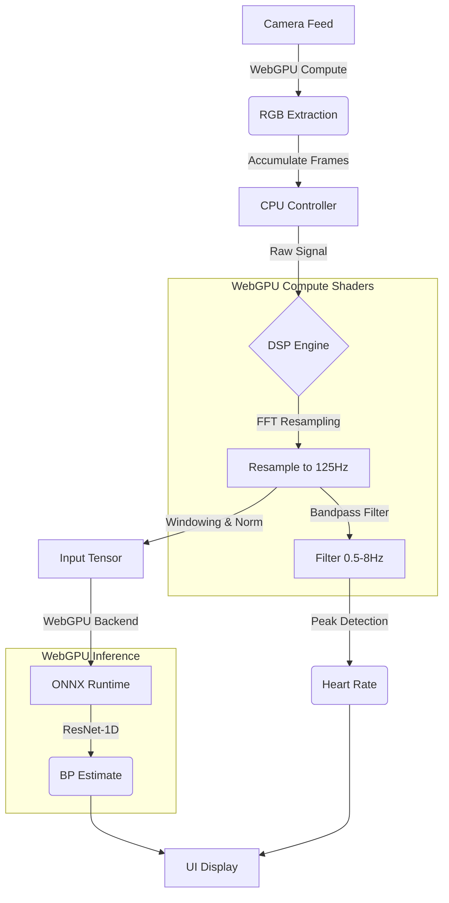

# Web-Based Blood Pressure Monitor

An experimental blood pressure estimation app that runs entirely in your browser.  This is by means of utilising WebGPU support for ONNX runtime webassembly.

**Features:**
- **Zero-Cloud Inference**: Uses WebGPU & ONNX Runtime to process video locally. No video  leaves your device.
- **Deep Learning**: Powered by a custom **ResNet-1D** model trained on the UCI Cuff-less Blood Pressure Dataset.

## Acknowledgements

This work is based on Sau-Sheong Chan's :
https://sausheong.com/monitoring-blood-pressure-with-machine-learning-c21ae044dd73
https://bpmon.sausheong.com/

---

## Quick Start (Web App)

The application is a modern React + Vite app located in the `web/` directory.

### Prerequisites
- Node.js 18+
- npm or pnpm

### Build & Run
```bash
# 1. Go to web directory
cd web

# 2. Install dependencies
npm install

# 3. Start development server
npm run dev
```
Open `http://localhost:5173` in your browser.

### Deploy (Firebase)
```bash
# Build for production
npm run build

# Deploy (requires firebase-tools)
firebase deploy
```

---

## Model Training (Python)

If you want to retrain the model or modify the architecture, follow these steps.

### 1. Dataset Setup
We use the **UCI Cuff-Less Blood Pressure Estimation Dataset**. Due to license/size, it is not included in this repo.

1. **Download** the dataset from [UCI Machine Learning Repository](https://archive.ics.uci.edu/ml/datasets/Cuff-Less+Blood+Pressure+Estimation).
2. **Extract** the files. You need the `.mat` files (`Part_1.mat`, `Part_2.mat`, etc.).
3. **Place them** in a folder named `uci_dataset/` in the project root:
   ```
   project_root/
   ├── uci_dataset/
   │   ├── Part_1.mat
   │   ├── Part_2.mat
   │   ├── Part_3.mat
   │   └── Part_4.mat
   ├── src/
   ├── web/
   └── ...
   ```

### 2. Environment Setup
```bash
# Create virtual environment
python3 -m venv .venv
source .venv/bin/activate

# Install dependencies
pip install -r src/trainer/requirements.txt
```

### 3. Run Training
The training script is located in `src/trainer/`.
```bash
# Run from project root
python src/trainer/train.py

# Options:
# Train on specific parts:  python src/trainer/train.py --parts 1 2
# Fast debug run:           python src/trainer/train.py --max-windows 1000
```
This will save the trained model to `model/bp_model_resnet.pt`.

### 4. Export to Web
To use your trained model in the web app, you must export it to ONNX format.
```bash
# Exports 'model/bp_model_resnet.pt' -> 'web/public/model.onnx'
python -m src.trainer.export_onnx
```

---

## Architecture

The system is designed for high-performance, privacy-preserving inference directly in the browser, leveraging **WebGPU** for the entire signal pipeline—not just model inference.

### System Flow


### Key Components

- **WebGPU Acceleration**:
    - **Signal Extraction** (`extract_rgb.wgsl`): A compute shader directly imports the camera feed as an external texture and calculates the average RGB intensity per frame. This avoids expensive CPU pixel readbacks.
    - **DSP Engine** (`resample.wgsl`, `bandpass.wgsl`): Complex signal processing algorithms are implemented as compute shaders:
        - **FFT Resampling**: Uses the Cooley-Tukey algorithm to resample the variable-FPS camera signal to a fixed 125Hz.
        - **Filtering**: Applies a 2nd-order Butterworth bandpass filter for heart rate calculation.
    - **Inference**: The ONNX Runtime (`ort-web`) executes the **ResNet-1D** model using the WebGPU backend, keeping tensors on the GPU where possible.

- **Data Pipeline**:
    - **Preprocessing**: The `src/trainer/export_scaler_json.py` script exports the exact training normalization statistics. The web app uses these to Z-score normalize the live signal (`(x - mean) / std`), ensuring the model sees data identical to its training set.
    - **Model**: A 1D ResNet (Residual Neural Network) trained on the UCI dataset, optimized for time-series physiological data.


